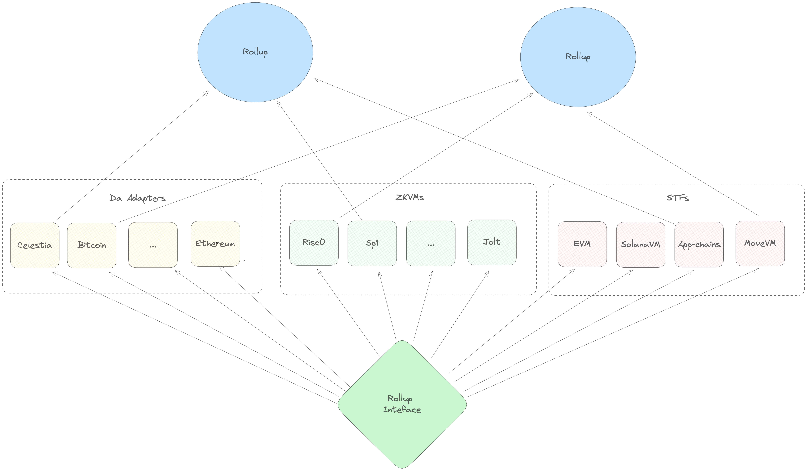

# Main Abstractions

> This document provides an overview of the major abstractions offered by the SDK.
>
> - Rollup Interface (STF + DA service + DA verifier)
> - sov-modules (`Runtime`, `Module`, stf-blueprint w/ account abstraction, state abstractions)
> - sov-sequencer
> - sov-db
> - Rockbound

One of the most important principles in the Sovereign SDK is modularity. We believe strongly in separating
rollups into their component parts and communicating through abstract interfaces. This allows us to iterate
more quickly (since components are unaware of the implementation details of other components), and it also
allows us to reuse components in contexts which are often quite different from the ones in which they were
orginally designed.

In this chapter, we'll give a brief overview of the core abstractions of the Sovereign SDK

## Native vs. ZK Execution

Perhaps the most fundamental abstraction in Sovereign is the separation between `"native"` code execution
(which computes a new rollup state) and zero-knowledge _verification_ of that state. Native execution is
the experience you're used to. In native execution, you have full access to networking, disk, etc. In
native mode, you typically trust data that you read from your own database, but not data that comes over
the network.

Zero-knowledge execution looks similar. You write normal-looking Rust code to do CPU and memory
operations - but under the hood, the environment is alien. In zero-knowledge execution, disk
and network operations are impossible. Instead, all input is received from the (untrusted)
machine generating the proof via a special syscall. So if you make a call that looks like a network access,
you might not get a response from `google.com`. Instead, the prover will pick some arbitrary bytes to
give back to you. The bytes might correspond to an actual response (i.e. if the prover is honest
and made the network request for you) - but they might also be specially crafted to deceive you.
So, in zero-knowledge mode, great care must be taken to avoid relying on unverified data from the
prover.

In the Sovereign SDK, we try to share code between the `"native"` full node implementation and the
zero-knowledge environment to the greatest extent possible. This minimizes surface area for bugs.
However, a full node necessarily needs a lot of logic which is unnecessary (and undesirable) to
execute in zero-knowledge. In the SDK, such code is gated behind a `cargo` feature called `"native"`.
This code includes RPC implementations, as well as logic to pre-process some data into formats which
are easier for the zero-knowledge code to verify.

## The Rollup Interface

If you squint hard enough, a zk-rollup is made of three separate components. There's an underlying
blockchain ("Data Availability layer"), a set of transaction execution rules ("a State Transition Function")
and a zero-knowledge proof system (a "ZKVM" for zero-knowledge virtual machine). In the abstract, it seems
like it should be possible to take the same transaction processing logic (i.e. the EVM) and deploy it on
top of many different DA layers. Similarly, you _should_ be able to take the same execution logic and compile
it down to several different proof systems - in the same way that you can take the same code an run it on
Risc0 or SP1.

Unfortunately, separating these components can be tricky in practice. For example, the OP Stack relies on an
Ethereum smart contract to enforce its censorship resistance guarantees - so, you can't
easily take an OP stack rollup and deploy it on a non-EVM chain.

In the Sovereign SDK, flexibility is a primary design goal. So we take care to codify this separation of concerns
into the framework from the very beginning. With Sovereign, it's possible to run any `State Transition Function`
alongside any `Da Service` on top of any (rust-compatible) proof system and get a functional rollup.
The `rollup-interface` crate is what makes this possible. Every other crate in the SDK depends on it,
because it defines the core abstractions that are shared between all SDK rollups.



Inside of the rollup interface, the `native` vs zero-knowledge distinction appears in numerous places. For example,
the `DA layer` abstraction has two components - a `DaService`, which runs as part of `native` full node execution and
provides methods for fetching data from the underlying blockchain; and `DaVerifier`, which runs in zero-knowledge
and verifies that the data being executed matches the provided DA block header.

### How it Works

Essentially, the Sovereign SDK is just a generic function that does this:

```rust
fn run_rollup<Da: DaService, Zk: Zkvm, Stf: StateTransitionFunction>(self, da: Da, zkvm: Zk, business_logic: Stf) {
	loop {
		// Run some `native` code to get the data for execution
		let (block_data, block_header) = da.get_next_block();
		let (input_state, input_state_root) = self.db.get_state();
		// Run some zero-knowledge code to execute the block
		let proof = zkvm.prove(|| {
			// Check that the inputs match the provided commitments
			if !da.verify(block_data, block_header) || !input_state.verify(input_state_root) {
				panic!()
			};
			// Make the data commitments part of the public proof
			output!(block_header.hash(), input_state_root)
			let output_state_root = business_logic.run(block_data, input_state);
			// Add the output root to the public proof
			output!(output_state_root)
		});
		// Publish the proof onto the DA layer
		da.publish(proof);
	}
}
```

As you can see, most of the heavy lifting is done by the DA layer, the `Zkvm` and the rollup's business logic.
The full node implementation is basically just glue holding these components together.

### DA

As discussed above, the role of the DA layer is to order and publish data. To integrate with the Sovereign SDK,
a DA layer needs to provide implementations of two core traits: `DaService` and `DaVerifier`.

#### DA Service

The `DaService` trait is usually just a thin wrapper around a DA layer's standard RPC client. This trait
provides standardized methods for fetching data, generating merkle proofs, and publishing data. Because
it interacts with the network, correct execution of this trait is _not_ provable in zero-knowledge.

Instead, the work of verifying of the data provided by the `DaService` is offloaded to the `DaVerifier` trait.
Since the `DaService` runs only in `native` code, its implementation is less concerned about efficiency than
zero-knowledge code. It's also easier to patch, since updating the `DaService` does _not_ require any light
clients or bridges to update.

The `DaService` is the only component of the SDK responsible for publishing and fetching data. The SDK's node
does not currently have a peer-to-peer network of its own. This dramatically simplifies the full node and reduces
bandwidth requirements.

### DA Verifier

The `DaVerifier` is the zero-knowledge-provable counterpart of the `DaService`. It is responsible for checking
that the (untrusted) private inputs to a proof match the public commitment _as efficiently as possible_. It's common
for the `DaVerifier` to offload some work to the `DaService` (i.e. as computing extra metadata) in order to reduce
the amount of computation required by the `DaVerifier`.

At the level of `Rust` code, we encode the relationship between the `DaVerifier` and the `DaService` using a helper
trait called `DaSpec` - which specifies the types on which both interfaces operate.

#### Zero Knowledge Virtual Machine ("`Zkvm`")

The `Zkvm` traits make a zk-snark system (like `Risc0` or `Sp1`) compatible with the Sovereign SDK. Like the `DA layer`, we
separate `Zkvm` traits into a `native` and zk version, plus a shared helper.

The `ZkvmHost` trait describes how a `native` computer executes an `elf` file (generated from `Rust` code) and generates
a zero-knowledge proof. It also describes how the `native` machine passes private inputs (the "witness") into the execution.

The `ZkvmGuest` trait describes how a program running in zero-knowledge mode accepts inputs from the host machine.

Finally, the `Zkvm` trait describes how a proof generated by the host is verified. This trait is implemented by both the
`Host` and the `Guest`, which is how we represent that proofs must be verifiable `native`ly and recursively (i.e. inside
another SNARK.)

#### State Transition

A `StateTransitionFunction` ("STF") is a trait which describes:

1.  How to initialize a rollup's state at genesis

2.  How to apply the data from the DA layer to generate a new state

In other words, the implementation of `StateTransitionFunction` is what defines the rollup's "business logic".

In the Sovereign SDK, we define a generic full node which can run any STF. As long as your logic implements the
interface, we should be able to run it.

However, implementing the business logic of a rollup is _extremely_ complicated. While it's relatively easy to
roll your own implementation of the `Da` or `Zkvm` traits, building a secure STF from scratch is a massive undertaking.
It's so complex, in fact, that we assume no one will ever do it - andthe vast majority of the Sovereign SDK's code is
devoted to providing a generic implementation of an STF that developers can customize. (This STF is what we call the
Sovereign module system, or sov-modules).

So if no one is ever going to implement the `StateTransitionFunction` interface, why bother maintaining it at all?
One reason is for flexibility. Just because we don't expect anyone to roll their own STF doesn't mean that they won't.
But a bigger motivation is to keep concerns separate. By hiding the implementation details of the rollup behind the
STF interface, we build a firm abstraction barrier between it and the full node. This means that we're free to make
breaking changes on either side of the wall (either in the node, or in the STF) without worrying about breaking the
other component.

## Sov Modules

Outside of the rollup interface, the most important abstraction is `sov-modules`. `sov-modules` is a pre-built STF
with pluggable... modules. It does the heavy lifting of implementing a secure STF so that you can focus on the core
logic of your application.

### The Runtime

At the heart of any sov-modules rollup is the `Runtime`:

```rust
// An example runtime similar to the one used in our "standard" demo rollup
pub struct Runtime<S: Spec, Da: DaSpec> {
    /// The Bank module implements fungible tokens, which are needed to charge `gas`
    pub bank: sov_bank::Bank<S>,
    /// The Sequencer Registry module is where we track which addresses can send batches to the rollup
    pub sequencer_registry: sov_sequencer_registry::SequencerRegistry<S, Da>,
    /// The Prover Incentives module is where we reward provers who do useful work
    pub prover_incentives: sov_prover_incentives::ProverIncentives<S, Da>,
    /// The Accounts module implements identities on the rollup. All of the other modules rely on it
	/// to link cryptographic keys to logical accounts
    pub accounts: sov_accounts::Accounts<S>,
	/// The NFT module provides an implementation of a non-fungible token standard. It's totally optional.
    pub nft: sov_nft_module::NonFungibleToken<S>,
    #[cfg_attr(feature = "native", cli_skip)]
    /// The EVM module lets the rollup run Ethereum smart contracts. It's totally optional.
    pub evm: sov_evm::Evm<S, Da>,
}
```

At the highest level, a runtime is "just" a collection of all the modules which are included in your rollup.
Its job is to take `Transaction`s and dispatch them to the appropriate module for execution.

Pretty much all rollups built with the `sov-modules` include the bank, the sequencer registry, and the accounts
module in their `Runtime`. They also usually include one of `sov_prover_incentives`
(if they're a zk-rollup) or `sov_attester_incentives` (if they're an Optimistic rollup).

You may also have noticed that the `Runtime` is generic over two types - a `Spec` and a `DaSpec`. These two types
describe the core types (addresses, hashers, cryptography) used by the rollup and the DA layer respectively.
Making your runtime generic over a Spec means that you can easily change DA layers, or swap any of the core
primitives of your rollup. For example, a rollup can trivially switch from Ed25519 to secp256k1 for its
signature scheme by changing the implementation of its `Spec` trait.

### Modules

"Modules" are the things that process transactions. For example, the `Bank` module lets users transfer tokens
to each other. And the `EVM` module implements a full Ethereum Virtual Machine that can process any valid Ethereum
transaction.

A `Module` is just a rust `struct` that implements two traits called `Module` and `ModuleInfo`.

#### The `Module` trait

The `Module` trait is like a simplified version of the `StateTransitionFunction`. It describes how to
initialize the module at the rollup's genesis, and how the module processes `CallMessage`s received
from users (i.e. how it processes transactions)

```rust
pub trait Module {
	// -- Some associated type definitions are omitted here --
	/// Module defined argument to the call method.
    type CallMessage: Debug;

    /// Genesis is called when a rollup is deployed and can be used to set initial state values in the module.
    fn genesis(
        &self,
        _config: &Self::Config,
        _working_set: &mut WorkingSet<Self::Spec>,
    ) -> Result<(), ModuleError>;

    /// Call allows interaction with the module and invokes state changes.
    /// It takes a module defined type and a context as parameters.
    fn call(&self,
        _message: Self::CallMessage,
        _context: &Context<Self::Spec>,
        _working_set: &mut WorkingSet<Self::Spec>,
    ) -> Result<CallResponse, ModuleError>;
}
```

The `Accounts` module provides a good example of a standard `Module` trait implementation.

```rust
pub enum CallMessage<S: Spec> {
    /// Updates a public key for the corresponding Account.
    /// The sender must be in possession of the new key.
    UpdatePublicKey(
        /// The new public key
        <S::CryptoSpec as CryptoSpec>::PublicKey,
        /// A valid signature from the new public key
        <S::CryptoSpec as CryptoSpec>::Signature,
    ),
}

impl<S: Spec> sov_modules_api::Module for Accounts<S> {
	// -- Some items ommitted here --
    fn call(
        &self,
        msg: Self::CallMessage,
        context: &Context<S>,
        working_set: &mut WorkingSet<S>,
    ) -> Result<sov_modules_api::CallResponse, Error> {
        match msg {
            call::CallMessage::UpdatePublicKey(new_pub_key, sig) => {
				// Find the account of the sender
				let pub_key = self.public_keys.get(context.sender(), working_set)?;
				let account = self.accounts.get(&pub_key, working_set);
				// Update the public key (account data remains the same).
				self.accounts.set(&new_pub_key, &account, working_set);
				self.public_keys
					.set(context.sender(), &new_pub_key, working_set);
				Ok(Default::default())
            }
        }
    }
}

```

#### The `ModuleInfo` trait

The `ModuleInfo` trait describes how the module interacts with the broader module _system_. Each
module has a unique ID and stores its state under a unique `prefix` of the global key-value store
provided by `sov-modules`

```rust
pub trait ModuleInfo {
    /// Returns id of the module.
    fn id(&self) -> &ModuleId;

    /// Returns the prefix where module state is stored.
    fn prefix(&self) -> ModulePrefix;

    /// Returns addresses of all the other modules this module is dependent on
    fn dependencies(&self) -> Vec<&ModuleId>;
}
```

Unlike the `Module` trait, its incredibly rare for developers to implement `ModuleInfo` by hand.
Instead, it's strongly recommended to derive the `ModuleInfo` using our handy macro. A typical
usage looks like this:

```rust
#[derive(ModuleInfo, Clone)]
pub struct Bank<S: sov_modules_api::Spec> {
    /// The id of the sov-bank module.
    #[id]
    pub(crate) id: ModuleId,

    /// The gas configuration of the sov-bank module.
    #[gas]
    pub(crate) gas: BankGasConfig<S::Gas>,

    /// A mapping of [`TokenId`]s to tokens in the sov-bank.
    #[state]
    pub(crate) tokens: sov_modules_api::StateMap<TokenId, Token<S>>,
}
```

This code automatically generates a unique ID for the bank module and stores it in the field
of the module called `id`. It also initializes the `StateMap` "`tokens`" so that any keys stored in the map
will be prefixed the with module's `prefix`. This prevents collisions in case a different module also
declares a `StateMap` where the keys are `TokenId`s.
