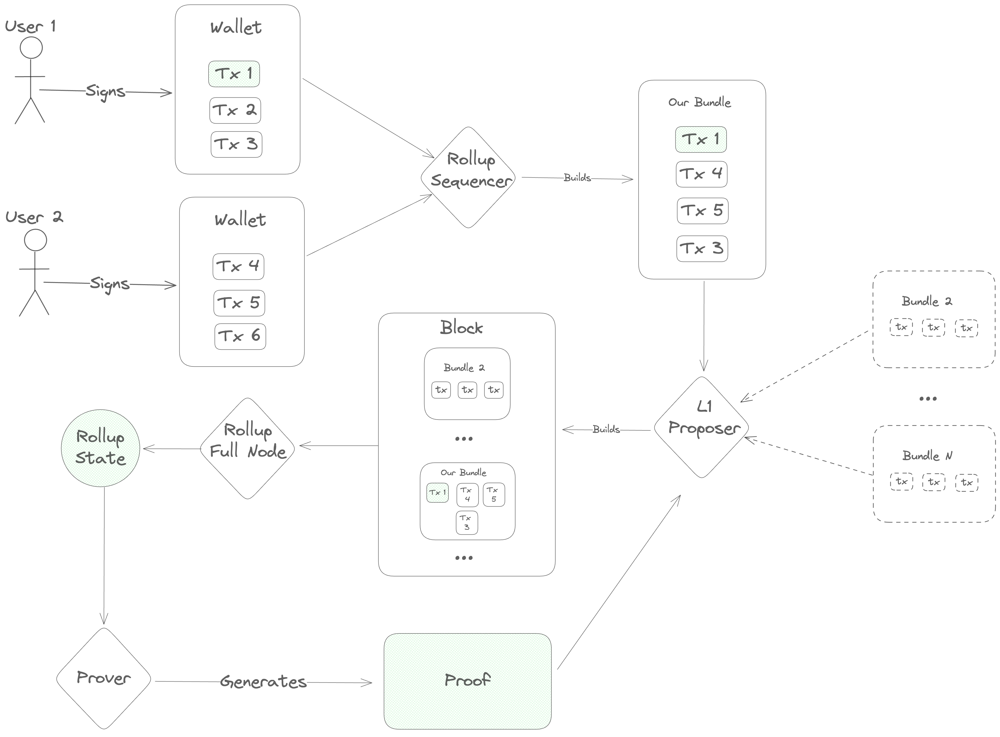

# Transaction Lifecyle Overview

The transaction lifecycle begins with a _user_. First, the user opens a frontend and gets some information about the
current state of the blockchain. Then, they open their wallet and sign a message indicating what action they want to take.

Once a message is signed, it needs to be ordered before full nodes can execute it, so
the user's next step is to contact a _sequencer_ to post the transaction onto the DA layer.

The sequencer accepts a number of transactions and bundles them into a single _`Blob`_, which he sends to the DA layer for
inclusion. This `Blob` is ultimately sent to a `Proposer` on the DA layer, who includes it in his block and gets it approved
by the DA layer's validator set. Once consensus is reached on the DA layer block containing the sequencer's `Blob`, the
full nodes of the rollup parse its contents and execute the transactions, computing a new rollup state.

Next, specialized actors ("provers" or "attesters") generate a proof of the new rollup state and post it onto the `DA layer`.
Finally, light clients of the rollup (end-users and/or bridges on other blockchains) verify the proof and see the results of the transaction.

# SDK Design Philosophy

Now that we've established the basic transaction lifecycle, we have the background we need to really dig into the design of the Sovereign SDK.

At a high level, the design process for the SDK was essentially just tracing the transaction lifecycle diagram and asking two questions at each step:
- "How do we implement this step so that we really 'inherit the security of the L1'?"
- "Within those constraints, how do we build the SDK to accommodate the broadest range of use cases?"

## Step 1: Retrieving Information

Before doing anything, users need to find out about the current state of the rollup. How can we enable that?

At this step, we have several conflicting goals and constraints:
  - We want the user's view of the rollup to be as up-to-date as possible
  - We want to provide the strongest possible guarantees that the user's view of state is correct
  - We want to minimize costs for the rollup
  - Users may not be willing/able to download more than a few hundred kilobytes of data or do any significant computation

Obviously, it's not possible to optimize all of these constraints simultaneously. So, in the Sovereign SDK, we
allow developers some flexibility to pick the appropriate tradeoffs for their rollups -
and we give end-users additional flexibility to choose the setup that works best for them.

In practice, that means that...
- Developers can choose between Optimistic and ZK rollups, trading transaction cost for time-to-finality.
- Users can choose between running a full node (instant state access, but expensive), running a light client
(slower state access, but much cheaper and trustless) and trusting a full node (instant state access)

## Step 2: Signing Transactions

The crypto community has fifteen years of experience building wallets for L1 blockchains.
That means that existing wallets are much better than anything we could build in a couple of weeks.
But at the same time, the user experience is... not great. Users lose all of their funds pretty regularly, and
they still have to deal with complexity like storing seed phrases and inspecting transaction hashes.

So, we've made the pragmatic choice to be as compatible as possible with existing crypto wallets, while leaving
the door open for future improvements.

In rollups built with `sov-modules`, this is enabled by the `RuntimeAuthenticator` abstraction built into
the [`stf-blueprint`](module-system/sov-modules-stf-blueprint/src/lib.rs).
Using this trait, we allow rollup developers to bring their own transaction deserialization and authorization
logic. Even better, we allow rollups to support several different `Authenticator` implementations
simultaneously. This allows developers to retain backward compatibility with existing wallets, without giving
up the freedom to create specialized transaction formats that integrate more deeply with the rollup's logic
and the wallet interface.

## Step 3: Sequencing

Once a user has signed a transaction, we need to broadcast it to all full nodes of the rollup.

Since a primary design goal is to inherit the security of the underlying blockchain, we want to ensure that users
are always able to fall back on the censorship resistance of the L1 if necessary. At the same time, we don't expect
users to interact directly with the underlying blockchain in the normal case. The underlying blockchain will charge
fees in its own token, and we don't need or want users of the rollup to be thinking about exchange rates and L1 gas
limits.

We also need to protect the rollup from spam. In a standard blockchain, spam is handled by ensuring that everyone
pays for the computation that the network does on their behalf. Transactions with invalid signatures are filtered out at the
peer-to-peer layer and never get included in blocks. This means that an attacker wanting to spam the blockchain has no
asymmetric advantage. He can send invalid transactions to the few nodes he happens to be directly connected to, but they will
just disconnect. The only way to get the _entire blockchain network_ to process a transaction is to provide a valid
signature and pay enough gas fees to cover the cost of execution.

In a rollup, things are different. Rollups _inherit_ the consensus of an underlying blockchain _which doesn't know
about the transaction validity rules of the rollup_. Since the underlying chain doesn't know the rules, it can't enforce them.
So, we need to be prepared to deal with the fact that the rollup's ledger is _dirty_. This is bad news, because checking
transaction signatures is expensive - especially in zero-knowledge. If we aren't careful, an attacker could flood the
rollup's ledger with malformed transactions and force the entire network to pay to check thousands of invalid signatures.

This is where the sequencer comes in. Sequencers accept transactions from users and bundle them into `Blob`s, which
get posted onto the L1. At the rollup level, we force all sequencers to register by locking up some tokens - and
we ignore any transactions which aren't posted by a registered sequencer. If a sequencer's bundle includes any
transactions which have invalid signatures, we slash his deposit and remove him from the registry. This solves
two problems at once. _Users_ don't need to worry about obtaining tokens to pay for inclusion on the DA layer,
and _the rollup_ gets builtin spam protection.

Unfortunately, this setup also gives sequencers a lot of power. Since the sequencer handles transactions before
they've gone through the DA layer's consensus mechanism, he can re-order transactions - and potentially
even halt the rollup by refusing to publish new transactions.

To mitigate this power, we need to make a couple of adjustments to the protocol.

First, we allow anyone to register as a sequencer depositing tokens into the sequencer registry. This is a
significant departure from most existing rollups, which rely on a single trusted sequencer.

Second, we allow sequencers to register _without sending a transaction through an existing sequencer_. Specifically,
we add a rule that the rollup will consider up to `K` extra blobs from unregisterd sequencers in each rollup
block. If any of the first `K` "unregistered" blobs conform to a special format, then the rollup will interpret
them as requests to register a new sequencer. By capping the number of unregistered blobs that we look at,
we limit the usefulness of unregistered blobs as a DOS vector while still ensuring that honest sequencers
can register relatively quickly in case of censorship.

Finally, we try to make sequencing competitive by distributing some of the fees from each transaction to the
sequencer who included it. This incentivizes new sequencers to register if the quality of service is low.

---

Ok, that was a lot of information. Let's recap.

In the Sovereign SDK, sequencers are middlemen who post transactions onto the DA layer, but it's the DA layer
which ultimately decides on the ordering of transactions. Anyone can register as a sequencer, but sequencers
expose themselves to slashing if they include transactions with invalid signatures (or certain other kinds
of obvious spam).

That covers a huge chunk of sequencing. But there are still two topics we haven't touched on: stateful validation,
and soft confirmations.

### Stateful Validation

Up to this point, we've been talking about transactions as if they're always either valid or invalid for all time,
regardless of what's happening on the rollup. But in the real world (especially when there are many sequencers),
that's not the case. To give just one example, it's entirely possible for an account to burn through all of its
funds with a single transaction, leaving nothing to pay gas with the next time around.
So, if two sequencers publish blobs at about the same time, it's very possible that the first blob will cause some
tranasactions in the second one to become invalid.

This complicates our analysis. Previously, we assumed that a sequencer was malicious if he caused any invalid
transactions to be processed. That meant that we could safely slash his deposit and move on whenever we encountered
a validation error. But now, we can't make that assumption. Otherwise, sequencers would have to be extremely
conservative about which transactions they included - since a malicious (or confused) user could potentially cause a sequencer
to get slashed by sending conflicting transactions to two different sequencers at the same time.

On the other hand, we don't want to let sequencers get away with including transactions that they _know_ are invalid.
Otherwise, a malicious sequencer could include invalid transactions "for free", causing the rollup to do a bunch
of wasted computation.

We address these issues by splitting transaction validation into two categories. Stateless validation (i.e. signature
checks) happens first, and transactions which fail stateless validation are invalid _forever_. If a sequencer
includes a transaction which is statelessly invalid, then we know he's malicious.
After a transaction has passed stateless validation, we proceed to make some stateful checks (i.e. checking that
the transaction isn't a duplicate, and that the account has enough funds to pay for gas). If these checks fail,
we charge the sequencer a small fee - just enough to cover the cost of the signature check.

This ensures that sequencers are incentivized to do their best to filter out invalid transactions, and that the
rollup never does any computation without getting paid for it without being unfairly punitive.

### Soft Confirmations

Now that we've talked about the minimum requirements for sequencer, we move on to soft-confirmations.

One of the biggest selling points of rollups today is the ability to tell users the outcome of the transaction instantly.
Under the hood, this experience is enabled by giving a single trusted sequencer a "lock" on the rollup state.
Because he holds the lock, the sequencer can run a local simulation to determine the exact effect of a transaction
_before_ he posts it on the DA layer.

Unfortunately, this introduces a load bearing point of centralization. If the centralized sequencer becomes
unavailable (or is malicious), the rollup halts and users have little recourse.

On existing rollups, this issue is somewhat mitigated by providing an "inbox" on the DA layer where users can
send special "forced withdrawal" transactions. However, in most existing rollups these "forced" transactions
are significantly less powerful than ordinary ones. (Users are often limited to only withdrawing funds)
and the delay period before they are processed is long.

In the Sovereign SDK, we try to do better. Unfortunately, there's no way to enable soft confirmations without
giving some entity a lock on (some subset of) the rollup state. So, this is exactly what we do. We allow rollup
deployers to specify some special "preferred sequencer", which has a partial lock on the rollup state.

In order to protect users in case of a malicious sequencer, though, we make a few additional changes to the
rollup.

First, we separate the rollup state into two subsets, "user" space and "kernel" space. The kernel state of the
rollup is maintained programatically, and it depends directly on the headers of the latest DA layer blocks. Inside
of the protected kernel state, the rollup maintains a list of all the blobs that have appeared on the DA layer,
and the block number in which they appeared.

Second, we prevent access to the kernel state of the rollup during transaction execution. This prevents users
from creating transactions that could accidentally invalidate soft-confirmations given by the sequencer, as well
as preventing the sequencer from deleting forced transactions before they can be processsed.

Finally, we add two new invariants:

  1. Every blob which appears on the (canonical) DA chain will be processed within some fixed number of blocks

  2. All "forced" (non-preferred) transactions will be processed in the order they appeared on the DA layer

To help enforce these invariants, we add a concept of a "virtual" slot number. The virtual slot number is a
nondecreasing integer which represents block number that the preferred sequencer observed when he started building his current
bundle. Any "forced" blobs which appear on the DA layer are processed when the virtual slot number advances beyond
the number of the _real_ slot in which they appeared.

Inside the rollup, we enforce that...

- The virtual slot number never lags behind the real slot number by more than some constant `K` slots

   - This ensures that "forced" transactions are always processed in a reasonable time frame

- The virtual slot number increments by _at least_ one every time the preferred sequencer succesfully submits a blob. The sequencer
may increment the virtual slot by more than one.

- The virtual slot number is never be greater than the current (real) slot number

- Transactions may only access information about the DA layer that was known at the time of their _virtual_ slot's creation.
Otherwise, users could write transactions whose outcome couldn't be predicted, making it impossible to give out soft confirmations.
	- For example, a user could say `if current_block_hash % 2 == 1 { do_something() }`, which has a different outcome depending on exactly
which block it gets included in. Since the rollup sequencer is not the L1 block proposer, he doesn't know what block the transaction
will get included in! By limiting transactions to accessing historical information, we avoid this issue.

What all of this means in practice is that...
- The visible state never changes unless either the preferred sequencer submits a bundle, or a timeout occurs (i.e. the virtual
slot lags too far). This ensures that the preferred sequencer always knows the exact state that he's building on top of.
- An honest sequencer wants to keep the virtual slot number as close to the real slot number as possible. This way, he has more
buffer to absorb downtime without the state changing. This reduces the risk of soft-confirmations being invalidated.
- Honest sequencers can always give accurate soft confirmations, unless the DA layer experiences a liveness failure lasting more
than `K` slots.
- Transactions can access information about the underlying blockchain with the best latency that doesn't invalidate soft confirmations.

### Handling Preferred Sequencer Failure

With the current design, the Sovereign SDK supports soft confirmations while providing a reasonably powerful forced transaction mechanism.
We also provide some limited protection from a malicious sequencer. If the sequencer is malicious, he can - at worst - delay transaction
processing by some constant number of blocks. He can't prevent forced transactions from being processed, and he can't selectively
delay transactions.

We also provide some limited protection if the preferred sequencer commits a slashable offense. In this case, the rollup enters "recovery mode",
where it reverts to standard "based" sequencing (where all sequencer are equal). In this mode, it advances the virtual slot number
two-at-a-time until the rollup is caught up, at which point the rollup behaves as if there had never been a preferred sequencer.

In the future, we may also add slashing if the preferred sequencer gives "soft-confirmations" which turn out to be invalid, but this
requires some additional design work.

## Step 4: Execution

Once a transaction is sequenced, the rollup needs to process it.

At a high level, a Sovereign SDK transaction goes through the following sequence:

  1. (Stateless) Deserialization: Decoding the bytes of the transaction into meaningful components (signature, ChainID, etc)

  2. (Stateful) Pre-validation: Checking that the address which is claiming to have authorized the transaction exists and
retrieving its preferences for authorization. For example, if the address is a multisig, fetch the set of public keys and
the minimum number of signatures.

  3. (Stateless) Authentication: Checking that the transaction is authorized. For example, checking that the signatures are valid.

  4. (Stateful) Authorization: Matching the results of the authentication and pre-validation steps to decide whether to execute. This step
  also reserves the funds to pay for gas used during transaction execution.
  --- State changes up to this point are irreversable. State changes beyond this point are either committed or reverted together

  5. (Stateful) Pre-dispatch hook: This hook allows _all_ modules to inspect the transaction (and their own state) and do initialization
  before the transaction is executed. For example, a wallet module might use this hook to check the user's balance and store it for
  later retrieval. This hook may abort the transaction and revert any state changes by returning an `Error`.
  6. (Stateful) Execution: The transaction is dispatched to a _single_ target module for execution. That module may invoke other modules
  if necessary during execution. If this call returns an error, all state changes from step 5 onward are reverted.
  7. (Stateful) Post-dispatch hook: This hook allows _all_ modules to inspect their state and revert the transaction if necessary.
  If this call returns an error, all state changes from step 5 onward are reverted.
  8. (Stateful) Post-execution: After transaction execution, any unused gas is refunded to the payer

As described in the "Sequencing" documentation, sequencers are slashed if any of the two stateless steps fail. If either of the
stateful steps prior to execution fail, the sequencer is penalized - but just enough to cover the cost of the work that has been done.
If the transaction fails during execution, the costs are paid by the user (or whichever entity is sponsoring the gas cost of the
transaction.)

For more details on execution, see [TODO]

## Step 5: Proving

Once a transaction is executed, all of the rollup _full nodes_ know the result instantly. Light clients, on the other hand need proof.
In this section, we'll describe the different kinds of proof that the Sovereign SDK offers.

### Zero-Knowledge Proofs

The most powerful configuration for a rollup is zero-knowledge mode. In this mode, light clients can trustlessly sync the chain
with near-zero overhead and only minutes of lag behind the chain tip. This enables fast and trustless bridging between rollups,
and between the rollup and the execution environment of its DA layer (if applicable).

In the Sovereign SDK, proving is asynchronous (meaning that we post raw *transactions* on the DA layer - so that full nodes
can compute the rollup state even before a proof is generated). This means that light clients have a view of the state that
lags a little bit behind full nodes.

#### Proof Statements

All zero-knowledge proofs have the form, "I know of an input such that...". In our case, the full statement is:

> I know of a DA layer block with hash X (where X is a public input to the proof) and a rollup state root Y (where Y is another public input)
> such that the rollup transitions to state Z (another public input) when you apply its transaction processing rules.

To checkthis proof, a client of the rollup needs to check that the input block hash X corresponds to the next DA layer block, and that
the input state root Y corresponds to the current rollup state. If so, the client can advance its view of the state from Y to Z.

This works great for a single block. But if a client needs to validate the entire history of the rollup, checking proofs of each
block would get expensive. To alleviate this problem, we use recursive proofs to compress multiple block proofs into one.
(A nice property of zero-knowledge proofs is that the work to verify a proof is roughly constant - so checking this recursive
"aggregate" proof is no more expensive than checking the proof of a single block.)

Each `AggregateProof` is a statement of the form:

> I know of a (previous) valid `AggregateProof` starting from `A` (the genesis block hash, a public input)
> with state root `B` (the rollup's genesis state, a public input) and ending at block hash `C` with state root `D`.
> And, I know of a sequence of valid proofs such that...
>    - For each proof, the block header has the property that `header.prev_hash` is the hash of the previous header
>    - For each proof, the input state root is the output root of the previous root.
>    - The block header from the first proof has `prev_hash == C`
>    - The first proof has has input state root `D`
>    - The final proof in the chain has block hash `X` and output root `Y` (where `X` and `Y` are public inputs)

#### Incentives

Generating zero-knowledge proofs is expensive. So, if we want proofs to be generated, we need to
incentivize proof creation in protocol, preferrably using the gas fees that users are already paying.

In a standard blockchain, the goal of transaction fees markets is to maximize consumer surplus. They achieve this by allocating a scarce
resource (blockspace) to the people who value it most. Analysis shows that EIP-1559 is extremely good
at solving this optimization problem in the setting where supply is fixed and demand varies rapidly. EIP-1559 adjusts the price
of blockspace to the exact price level at which demand matches supply.

In zk-rollups, we have a slightly different setup. Our supply of blockspace is not constant. Instead, it's possible to invest more
money in proving hardware in order to increase the rollup's throughput. However, bringing more prover capacity online
takes time. Deals have to be negotiated, hardware provisioned, etc. So, in the short term, we model prover capacity
as being fixed - and we use EIP-1559 to adjust demand to fit that target.

In the long run, we want to adjust the gas limit to reflect the actual capacity of available provers. To facilitate this, we
track the rollup's gas usage and proving throughput (measured in gas per second) over time. If rollup blocks are full
and provers are able to keep up, we gradually increase the gas limit until blocks are no longer full or provers start
to fall behind.

This still leaves one problem... how do we incentivize provers to bring more hardware online? After all, adding more hardware
increases the gas limit, which increases the supply of blockspace. This causes congestion (and fees) to fall, increasing consumer surplus.
But provers don't get paid in consumer surplus, they get paid in fees. So, adding more hardware hurts _provers_ in two ways.
It increases their costs, and it reduces the average fee level. This means that provers are incentivized to provide as little
capacity as possible.

The way we handle this problem is by introducing competition. In Sovereign, we only reward the _first_ prover to publish a valid
proof of a block. Since proving is almost perfectly parallel, and provers are racing to prove the block first, a prover which
adds slightly more capacity than its rivals experiences a disproportionate increase in rewards. This should encourage provers
to bring as much capacity as possible.

Since we want to reward provers with funds on the rollup, we need consensus. (Otherwise, it would be trivial to cause a
chain split by creating a fork which sent some rewards to a different prover.) So, we require provers to post their proofs
on chain. The first prover to post a valid proof of a particular block gets rewarded with the majority of the `base_fee`s
collected from that block. This is a deviation from EIP-1559, where all base fees are burned. Intuitively, our construction
is still safe because provers "burn" money in electricity and hardware costs in order to create proofs. However, we also
hold a burn a small proportion of base fees as insurance in case proving costs ever fall to negligble levels.

Once a prover has posted his proof on the DA layer, two things happen. First, full nodes read the proof and, if it's valid
reward the prover. If it's invalid, the prover has his deposit slashed. (Just like a misbehaving sequencer. Also like
sequencers, data posted by un-bonded entities is ignored.) Second, light clients of the rollup download and verify the proof,
learning the state of the rollup. As an implementation detail, we require proofs which get posted on chain to be domain
separated, so that light clients can download just the proofs from a rollup without also needing to fetch all of hte
transaction data.

#### Summary: The proving workflow

So, putting this all together, the proving workflow looks like this:

  1. A DA layer block is produced at height `N`. This block contains some rollup transactions.

  2. Full nodes immediately process the transactions and compute a new state.

  3. Provers begin generating a proof of block `N`.

  4. (About 15 minutes later) a prover creates a valid proof of block `N`. In the meantime, DA layer blocks `N+1` through `N+X` have
	been produced.

	   a. At this point, full nodes are aware of rollup state `N+X`, while light clients are still unaware of `N`

  5. The prover creates a new `AggregateProof`, which...

	   a. Proves the validity of the proof of block `N`

	   b. Proves the validity of the previous `AggregateProof` (which covered the rollup's history from genesis to block `N-1`)

	   c. Optionally proves the validity of proofs of blocks `N+1`, `N+2`, ..., `N+X`, if such proofs are available. (Note that
	the `AggregateProof` must cover a contiguous range of blocks starting from genesis, but it may cover any number of blocks
	subject to that constraint.) For concreteness, suppose that in this case the prover includes blocks `N+1` through `N+5`.

  6. The prover posts the new `AggregateProof` onto the DA layer at some height - call it `N+30`. At this point, full nodes are
  aware of state `N+30` (which includes a reward for the prover), and light clients are aware of state `N+5`. At some point in the
  future, a proof of `N+30` will be generated, at which point light clients will become aware of the prover's reward.

### Optimistic Proofs

For some rollups, generating a full zero-knowledge proof is too expensive. For these applications, the Sovereign SDK
offers Optimistic Mode, which allows developers to trade some light-client latency for lower costs. With a zk-rollup,
light clients have a view of the state which lags behind by about 15 minutes (the time it takes to generate a) zero-
knowledge proof. However, at the end of those 15 minutes, light clients know the state with cryptographic certainty.

In an optimistic rollup, light clients have a different experience. They get some indication of the new rollup state
very quickly (usually in the very next block), but they need to wait much longer (usually about a day) to be sure that
their new view is correct. And, even in this case, clients only have "cryptoeconomic" certainty about the new state.

#### Proving Setup

In an optimistic rollup, the "proofs" checked by light clients are not (usually) proofs at all. Instead, they are simple
attestations. Attesters stake tokens on claims like "the state of the rollup at height `N` is `X`", and anyone who
successfully challenges a claim gets to keep half of the staked tokens. (The other half are burned to prevent an
attester from lying about the state and then challenging himself from another account and keeping his tokens).
In exchange, for their role in the process,  attesters are rewarded with some portion of the rollup's gas fees.
This compensates attesters for the opportunity cost of locking their capital.

This mechanism explains why light clients can know the state quickly with _some_ confidence right away, but
they take time to reach full certainty. Once they've seen an
attestation to a state, clients know that either the state is correct, or the attester is going to lose some amount
of capital. As time goes by and no one challenges the assertion, their confidence grows
until it reaches (near) certainty. (The point at which clients are certain about the outcome is usually called the
"finality period" or "finality delay".)

The previous generation of optimistic rollups (including Optimism and Arbitrum) relies on running an on-chain bisection
game over an execution trace to resolve disputes about the rollup state.
This requires $log_2(n)$ rounds of interaction, where `n` is the length of the trace (i.e. a few hundred million).
To handle the possibility of congestion or censorship, rollups need to set the timeout period of messages 
conservatively - which means that a dispute could take up to a week to resolve.

In the Sovereign SDK, we resolve disputes by generating a zero-knowledge proof of the outcome of the disputed block.
Since this only requires one round of interaction, we don't need the same challenge delay. However, we do need to
account for the fact that proving is a heavy process. Generating a proof might take a few hours, and proving
services might be experiencing congestion. To minimize the risk, we plan to set the finality period conservatively
at first (about one day) and reduce it over time as we gain confidence.

Otherwise, the overall proving setup is quite similar to that of a zk-rollup. Just as in zk-rollups, proofs (and
attestations) are posted onto the DA layer so that we have consensus about who to reward and who to slash. And,
just like a zk-rollup, optimistic proofs/attestations are posted into a separate "namespace" on the DA layer
(if possible) so that light clients can avoid downloading transaction data. The only other significant
distinction between optimistic and zk rollups in Sovereign is that optimistic rollups use block-level proofs
to resolve disputes instead of generating aggregate proofs which go all the way to genesis.

## Conclusion

In the Sovereign SDK, we try to provide security, flexibility, and performance _in that order_.

As a contributor, it's your job to maintain that hierarchy. Security must always come first. And in blockchain,
security is mostly about incentives. Especially in blockchain, you get what you incentivize. If your rollup
under-prices some valuable resource, you'll get spam. If you under pay for some service, that service won't
be provided reliably.

This is why incentive management is so deeply baked into the SDK. Every step - from sequencing to proving to execution
to finality - needs to be carefully orchestrated to keep the incentives of the participants in balance.

Once the setup is secure, our next priority is enabling the broadest set of use cases. We try to provide maximum
flexibility, and abstract as much functionality as possible into reusable components. You can read more about how
we achieve flexibility at the level of Rust code in the [abstractions](./abstractions.md) chapter.

Finally, we optimize performance. This means eliminating redundant computation, carefully managing
state access patterns, and considering the strengths and weaknesses of zero-knowledge proofs systems.

Happy hacking!
